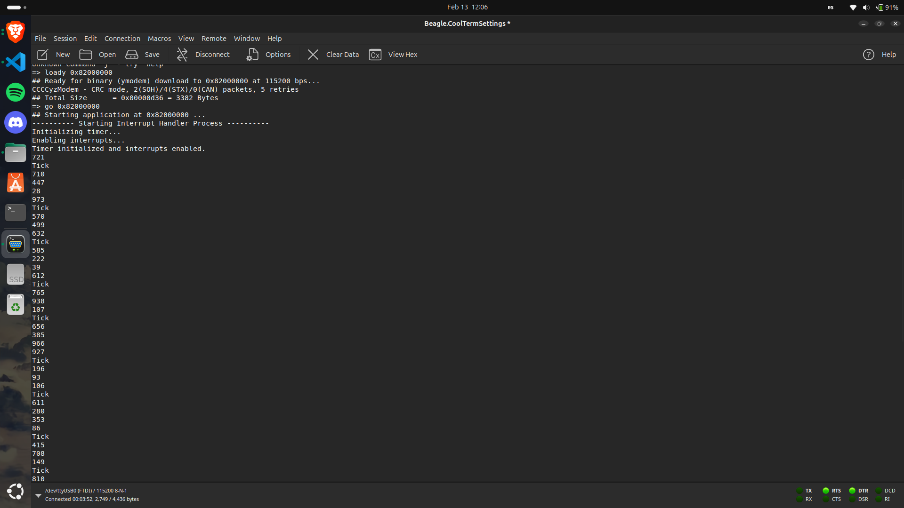

# Lab03 - Interrupt Handler
Assignment that focuses on the use of the BeagleBord Black's timers and handling of interrupts.
## Architecture design
The project is organized in a three layer design with the following structure:
```
003InterruptHandler/
├── assets/        <- Images used for demonstration
├── bin/           <- Generated compiled files from Make
├── lib/           <- Library level 
├── os/            <- Operating Systems level
└── source/        <- User level
```
### User Level
Highest abstraction level where the application logic resides. Does not interact with the hardware level directly, instead uses the library layer to implement the high level functions.
```
└── source/
  └── main.c
```
### Library Level
Intermediate level that interacts with the OS Level to provide functionalities to facilitate higher level operations.
```
└── lib/
  ├── random.h      <- random number generator library
  ├── stdio.h       <- standard input/output operations
  ├── stdlib.h      <- number-string convertion functions
  └── string.h      <- string manipulation functions
```
### OS Level
Lowest level of the application where the communication with the hardware occures. Simplifies the hardware operations for the higher level uses.
```
└── os/
  ├── drivers       <- low level use of the hardware
  │   ├── timer.h   <- timer configuration functions
  │   └── uart.h    <- serial communication functions
  ├── os.c          <- memory address for memory mapping
  └── root.s
```
---
## Functional description
Brief description of the defined functions.
### User Level
#### `main.c`
Main application logic. Initialize timer and enables interrupts, going into the main loop afterwards to continuosly generate random numbers.

---
### Library Level
#### `random.h`
`unsigned int rand(void)`  
Random number generator based on the linear congruential generator.  
**Returns:**  
Random number
#### `stdio.h`
`void PRINT(const char *format, ...)`  
Display the given message on the terminal.  
**Parameters:**
* `format:` - the string to be displayed. Can contain the format for additional inputs to be inserted (%s for strings, %d for integers, %f for floating point numbers).
* `args:` - additional arguments to be passed according to the given format.  

`void READ(const char *format, ...)`  
Reads the input from the terminal following the given format.  
**Parameters:**
* `format:` - the format of the input to be read (%s to read string, %d to read integer, %f to read floating point number).
* `args:` - pointers to the memory spaces of where the inputs are to be saved.
#### `stdlib.h`
`int atoi(const char *s)`  
Function to convert string to integer.  
**Parameters:**
* `s:` - string representing the integer.  

**Returns:**  
converted integer

`void itoa(int num, char *buffer)`  
Function to convert integer to string representation.  
**Parameters:**
* `num:` - number to convert.
* `buffer:` - pointer to the space where the string will be stored.

`float atof(const char *s)`  
Function to convert string to floating point number.  
**Parameters:**
* `s:` - string containing the represented number.  

**Returns:**  
converted number or 0 if there's invalid character

`void ftoa(float num, char *buffer)`  
Function to convert float to string.  
**Parameters:**
* `num:` - number to convert.
* `buffer:` - memory space to store the resulting string.
#### `string.h`
`char *my_strncpy(char *dest, const char *src, size_t n)`  
Minimal implementation of strncpy.  
**Parameters:**
* `dest:` - destination where the new string will reside.
* `src:` - the source string.
* `n:` - size of the destination string.  

**Returns:**  
the copied string

---
### OS Level
#### `timer.h`
`void timer_init(int time_ns)`  
Initialization of the Timer 2.  
**Parameters:**
* `time_ns:` - timer duration in nano seconds

`void timer_irq_handler(void)`  
Handler of the Timer 2 interrupt.
#### `uart.h`
`void uart_putc(char c)`  
Function to send a single character via UART.  
**Parameters:**
* `c:` - character to be sent.

`char uart_getc(void)`  
Function to receive a single character via UART.  
**Returns:**
character received

`void os_write(const char *s)`  
Function to send a string via UART.  
**Parameters:**
* `s:` - string to be sent.

`void os_read(char *buffer, int max_length)`  
Function to receive a line of input via UART.  
**Parameters:**
* `buffer:` - string where the result will be stored.
* `max_length:` - the maximum length to be read.

`int uart_get_until_whitespace(char *buffer, int max_length, int *endsInNL)`  
Function to receive input until whitespace (space, tab, line break).  
**Parameters:**
* `buffer:` - string where the result will be stored.
* `max_length:` - the maximum length to be read.
* `endsInNL:` - pointer to integer indicating if the input ended in new line.  

**Returns:**
the length of the received input  
**Note:**
This function is used specifically for the READ function in stdio.h.

`int uart_get_match(const char match)`  
Function to receive input until a match or a mismatch (ignores white spaces).  
**Parameters:**
* `match:` - the match for the input.  

**Returns:**
whether there was a match or not  
**Note:**
This function is used specifically for the READ function in stdio.h.
## Demonstration
The correct execution of the program should output the random generated numbers and the string "Tick" each 2 seconds.
```
---------- Starting Interrupt Handler Process ----------
Initializing timer...
Enabling interrupts...
Timer initialized and interrupts enabled.
721
Tick
710
447
28
973
Tick
570
499
632
Tick
585
```

