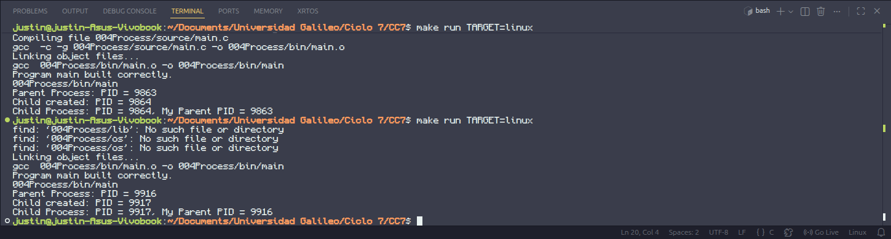

# Lab04 - Process Creation and Handling
Assignment focused on the creation of processes, handling and communication between processes on the Linux OS.  

---
## Part 1. Creating a new process.
A program that spawns a child process, then both parent and child displays their PID.
```
#include <unistd.h>
#include <sys/types.h>
#include <stdio.h>

int main(void) {
  pid_t children_pid = fork();

  if (children_pid == -1) {
    
  } else if (children_pid) {
    pid_t current_pid = getpid();
    printf("Parent Process: PID = %d\n", current_pid);
    printf("Child created: PID = %d\n", children_pid);
    sleep(1);
  } else {
    pid_t current_pid = getpid();
    pid_t parent_pid = getppid();
    printf("Child Process: PID = %d, My Parent PID = %d\n", current_pid, parent_pid);
    sleep(1);
  }
}
```
Output:  

### Process Creation Description
Using the `fork()` function to create a new process, the calling process is duplicated, running at a separate memory space but with the same content. For the parent process (the calling process), `fork()` will return the children process' ID if successful, otherwise -1. For the created children process, `fork()` will return 0. This is why in the main program, what each process should do is decided by the conditional checking the value of `childre_pid`, where the return value of `fork()` is stored.

---
