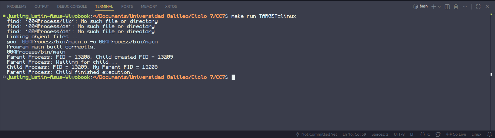
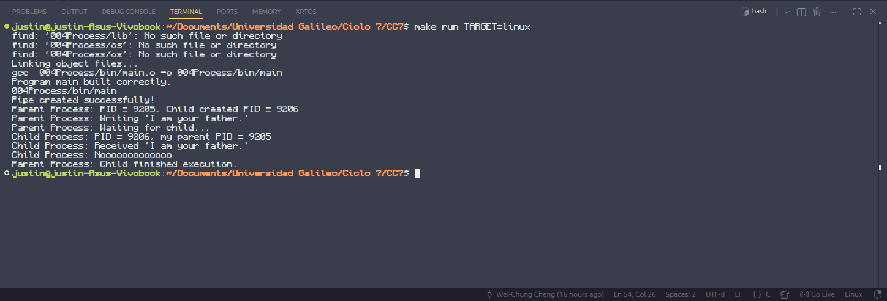
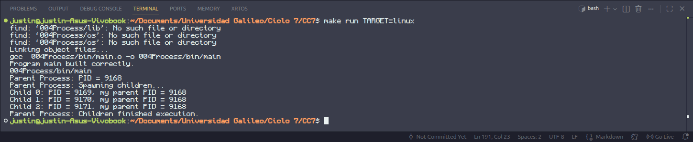
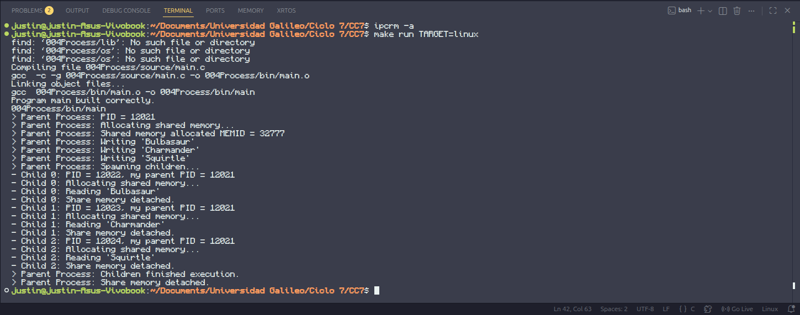

# Lab04 - Process Creation and Handling
Assignment focused on the creation of processes, handling and communication between processes on the Linux OS.  
The different versions of the program are recorded in the following document.

---
## Part 1. Creating a new process.
A program that spawns a child process, then both parent and child displays their PID.
```
#include <unistd.h>
#include <sys/types.h>
#include <stdio.h>

int main(void) {
  pid_t children_pid = fork();

  if (children_pid == -1) {
    
  } else if (children_pid) {
    pid_t current_pid = getpid();
    printf("Parent Process: PID = %d\n", current_pid);
    printf("Child created: PID = %d\n", children_pid);
    sleep(1);
  } else {
    pid_t current_pid = getpid();
    pid_t parent_pid = getppid();
    printf("Child Process: PID = %d, My Parent PID = %d\n", current_pid, parent_pid);
    sleep(1);
  }
}
```
Output:  

### Process Creation Description
Using the `fork()` function to create a new process, the calling process is duplicated, running at a separate memory space but with the same content. For the parent process (the calling process), `fork()` will return the children process' ID if successful, otherwise -1. For the created children process, `fork()` will return 0. This is why in the main program, what each process should do is decided by the conditional checking the value of `childre_pid`, where the return value of `fork()` is stored.

---
## Part 2. Synchronizing parent and children process.
To the previous program, added synchronizing of processes. Parent process waits for the child process to terminate.
```
#include <unistd.h>
#include <sys/types.h>
#include <sys/wait.h>
#include <stdio.h>

int main(void) {
  pid_t children_pid = fork();

  if (children_pid == -1) {
    printf("Error creating children process. No process spawned. Terminating.\n");
  } else if (children_pid) {
    pid_t current_pid = getpid();
    printf("Parent Process: PID = %d, Child created PID = %d\n", current_pid, children_pid);
    printf("Parent Process: Waiting for child...\n");
    waitpid(children_pid, NULL, 0);
    printf("Parent Process: Child finished execution.\n");
  } else {
    pid_t current_pid = getpid();
    pid_t parent_pid = getppid();
    printf("Child Process: PID = %d, My Parent PID = %d\n", current_pid, parent_pid);
    sleep(1);
  }
}
```
Output:  

### Process Synchronization Description
After the creation of the children process, the parent process calls the syscall `waitpid()` to suspend execution until any change of state happens on the children process. The default state change it will wait for is to be terminated. If the parent process doesn't wait, it will continue it's execution and terminate. In this case, the child process will be adopted by the init system of Linux to automatically perform a wait on the child and remove it.

---
## Part 3. Inter-process communication.
The parent process is able to maintain a one way communication with the children processes through a pipe.
```
#include <unistd.h>
#include <sys/types.h>
#include <sys/wait.h>
#include <stdio.h>

int child_process(int fd);

int main(void) {
  int pipe_file_descriptor[2];
  char message[20] = "I am your father.";

  if (pipe(pipe_file_descriptor)) {
    printf("Error creating the pipe. Terminating.\n");
  } else {
    printf("Pipe created successfully!\n");

    pid_t children_pid = fork();
    
    if (children_pid == -1) {
      printf("Error creating children process. No process spawned. Terminating.\n");
    } else if (children_pid) {
      // it's the parent process
      pid_t current_pid = getpid();
      printf("Parent Process: PID = %d, Child created PID = %d\n", current_pid, children_pid);

      printf("Parent Process: Writing '%s'\n", message);
      write(pipe_file_descriptor[1], message, 20);

      printf("Parent Process: Waiting for child...\n");
      waitpid(children_pid, NULL, 0);
      printf("Parent Process: Child finished execution.\n");
    } else {
      // it's the child process, calls function
      child_process(pipe_file_descriptor[0]);
    }
  }

}

/**
 * A simple child process.
 * @param fd: file descriptor for pipe unilateral communication
 * @return execution status of the child process
 */
int child_process(int fd) {
  char message[20];
  
  pid_t current_pid = getpid();
  pid_t parent_pid = getppid();
  printf("Child Process: PID = %d, my parent PID = %d\n", current_pid, parent_pid);
  
  read(fd, message, 20);
  printf("Child Process: Received '%s'\n", message);
  printf("Child Process: Nooooooooooooo\n");
}
```
Output:  

### Inter-process Communication Description
The communication between processes can be achieved by using a pipe. The pipe is created using the syscall `pipe(int *fd)`, which puts the read and write file descriptors to the given array `fd`. The file descriptors acts as unique identifiers to the I/O resources, in this case the pipe. Afterwards, the parent process can use the write end of the pipe `fd[1]` to send the message, using the syscall `write()`. The children can receive the message using the syscall `read()` and the read end of the pipe `fd[0]`.  

---
## Part 4. Creating multiple child processes.
Creating multiple child processes, all having the same parent, using a loop with `fork()`.
```
#include <unistd.h>
#include <sys/types.h>
#include <sys/wait.h>
#include <stdio.h>

#define   CHILD_PROCESSES   3

int child_process(int child_id);

int main(void) {
  int i;
  pid_t child_ids[CHILD_PROCESSES];
  pid_t child_pid, current_pid = getpid();

  printf("Parent Process: PID = %d\n", current_pid);
  printf("Parent Process: Spawning children...\n");

  for (i = 0; i < CHILD_PROCESSES; i++) {
    child_pid = fork();

    if (child_pid == -1) {
      printf("Error creating children process. No process spawned. Terminating.\n");
    } else if (!child_pid) {
      // child_pid == 0, child process
      child_process(i);
      break;
    } else {
      // parent process, store the child pid
      child_ids[i] = child_pid;
    }
  }

  if (child_pid) {
    for (i = 0; i < CHILD_PROCESSES; i++) {
      // parent process wait for the children
      waitpid(child_ids[i], NULL, 0);
    }
    printf("Parent Process: Children finished execution.\n");
  }
}

/**
 * A simple child process.
 * @param child_id: child id number relative to the parent
 * @return execution status of the child process
 */
int child_process(int child_id) {
  pid_t current_pid = getpid();
  pid_t parent_pid = getppid();
  printf("Child %d: PID = %d, my parent PID = %d\n", child_id, current_pid, parent_pid);
}
```
Output:  

### Multiple Process Creation Description
Using `fork()` with a loop can create multiple child processes in a common parent process. Given that all the child are duplicated from the parent, the process verification steps need to be done each time. To prevent the parent from terminating before the children, `wait()` needs to be called after the creation. This could be achieved either by calling `wait()` the same number of times as the number of children created, or by storing the each `child_pid` then using `waitpid()`.

---
## Part 5. Shared memory between processes.
Using `shmget()` and `shmat()` to set up a shared memory space between the processes.
```
#include <unistd.h>
#include <errno.h>
#include <sys/types.h>
#include <sys/wait.h>
#include <sys/shm.h>
#include <stdio.h>
#include <string.h>

#define   CHILD_PROCESSES   3

char *messages[3] = {"Bulbasaur", "Charmander", "Squirtle"};

int child_process(int child_id, int mem_id);

int main(void) {
  int i;
  pid_t child_ids[CHILD_PROCESSES];
  pid_t child_pid, current_pid = getpid();
  key_t key = 4951;
  char *shmem_pointer;

  printf("> Parent Process: PID = %d\n", current_pid);
  printf("> Parent Process: Allocating shared memory...\n");
  int mem_id = shmget(key, CHILD_PROCESSES * sizeof(char[12]), IPC_CREAT | 0600);
  if (mem_id == -1) {
    printf("Error allocating shared memory: %s\n", strerror(errno));
    return -1;
  }
  shmem_pointer = shmat(mem_id, NULL, 0);
  if (shmem_pointer == (void *) -1) {
    printf("Error attaching memory: %s\n", strerror(errno));
    return -1;
    
  }
  printf("> Parent Process: Shared memory allocated MEMID = %d\n", mem_id);
  // copy messages to memory space
  memcpy(shmem_pointer, messages[0], strlen(messages[0]) + 1);
  printf("> Parent Process: Writing '%s'\n", shmem_pointer);
  memcpy(shmem_pointer + 12, messages[1], strlen(messages[1]) + 1);
  printf("> Parent Process: Writing '%s'\n", shmem_pointer + 12);
  memcpy(shmem_pointer + 24, messages[2], strlen(messages[2]) + 1);
  printf("> Parent Process: Writing '%s'\n", shmem_pointer + 24);
  printf("> Parent Process: Spawning children...\n");

  for (i = 0; i < CHILD_PROCESSES; i++) {
    child_pid = fork();

    if (child_pid == -1) {
      printf("Error creating children process. No process spawned. Terminating.\n");
    } else if (!child_pid) {
      // child_pid == 0, child process
      child_process(i, mem_id);
      break;
    } else {
      // parent process, store the child pid
      child_ids[i] = child_pid;
    }
  }

  if (child_pid) {
    for (i = 0; i < CHILD_PROCESSES; i++) {
      // parent process wait for the children
      waitpid(child_ids[i], NULL, 0);
    }
    printf("> Parent Process: Children finished execution.\n");

    if (!shmdt(shmem_pointer)) {
      printf("> Parent Process: Share memory detached.\n");
    } else {
      printf("> Parent Process: Some error happened in memory detach.\n");
    }
  }
}

/**
 * A simple child process.
 * @param child_id: child id number relative to the parent
 * @param mem_id: shared memory id
 * @return execution status of the child process
 */
int child_process(int child_id, int mem_id) {
  pid_t current_pid = getpid();
  pid_t parent_pid = getppid();
  printf("- Child %d: PID = %d, my parent PID = %d\n", child_id, current_pid, parent_pid);
  printf("- Child %d: Allocating shared memory...\n", child_id);
  char *shared_mem = shmat(mem_id, NULL, SHM_RDONLY);
  printf("- Child %d: Reading '%s'\n", child_id, shared_mem + child_id * 12);
  if (!shmdt(shared_mem)) {
    printf("- Child %d: Share memory detached.\n", child_id);
  } else {
    printf("- Child %d: Some error happened in memory detach.\n", child_id);
  }
}
```
Output:  

### Shared Memory Description
Using the syscall `shmget()`, a System V shared memory segment of given size is created and associated with an identifier. In this case, the size is `CHILD_PROCESSES * size(char[12])` to store three strings of length 11 (and null terminator). The flag `IPC_CREAT` is given to indicate a creation of shared memory segment, with an or with 0600 to give read/write permissions. The generated `mem_id` is later used for attaching the shared memory segment with a local memory space of the running process, with the syscall `shmat()`. With this, the share memory can be manipulated as if it were a local memory space of the process. The only consideration is that the segment is a block of assigned bytes, so the concept of arrays indexing doesn't work in this memory manipulation.