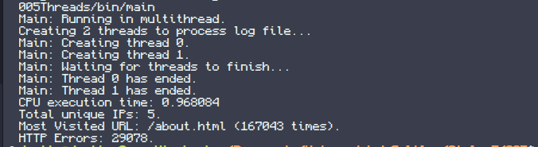
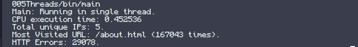

# **Lab05 - Threads**

This assignment focuses on the implementation of a Multi-Threaded Web Log Analyzer to efficiently process large text-based log files by parallelizing computation using the POSIX threads (pthreads) library.

## **Objective**

The primary goal is to learn how to use multi-threading to reduce execution time when processing millions of records. The program counts requests per unique IP, identifies the most visited URL, and tracks HTTP errors (status codes 400-599).

## **Architecture design**

The project follows a modular design. The OS-specific layer has been abstracted to focus on the application and library logic:
```
005Threads/  
├── assets/        <- Images used for demonstration  
├── bin/           <- Generated compiled files from Make  
├── lib/           <- Library level (Log processing logic)  
└── source/        <- User level (Main application)
```
### **User Level**

Highest abstraction level where the application flow is controlled. It decides whether to run in single-thread or multi-thread mode and manages the lifecycle of the threads.
```
└── source/  
  └── main.c
```
### **Library Level**

Intermediate level containing the core logic for parsing logs, managing shared data structures (Hash Tables), and handling synchronization via semaphores.
```
└── lib/  
  ├── ht.h             <- Header for hash table
  ├── ht.c             <- Implementation of hash table  
  ├── log_processor.h  <- Header with function prototypes  
  └── log_processor.c  <- Implementation of log processing and sync
```
## **Functional description**

Brief description of the defined functions.

### **User Level**

#### **main.c**

`void* process_log(void* args)`

The worker function for each thread. It continuously reads log entries and updates shared counters until the end of the file.

**Parameters:**

* `args:` - pointer to thread-specific arguments (unused in this implementation).  
  **Returns:**  
  NULL

`int get_most_visited(char* most_visited)`

Iterates over the URL hash table to find the entry with the highest visit count.

**Parameters:**

* `most_visited:` - address to store the string of the most visited URL.  
  **Returns:**  
  the count of the most visited URL.

`int process_single_thread()`

Executes the log processing logic sequentially without using thread synchronization.

`int process_multithread()`

Initializes semaphores, creates the specified number of threads, waits for their completion (join), and cleans up synchronization primitives.

**Returns:**

0 on success, -1 on error.

### **Library Level**

#### **log_processor.c**

`void semaphores_init()`

Initializes the named semaphores used to protect shared resources (file, hash tables, and error counter).

`uint8_t parse_log_entry_multit(FILE* file, char* ip, char* url, uint16_t* status)`

Thread-safe version of the log parser. Uses a mutex to ensure only one thread reads from the file pointer at a time.

**Parameters:**

* `file:` - the opened log file stream.  
* `ip:` - buffer for the extracted IP.  
* `url:` - buffer for the extracted URL.  
* `status:` - pointer to store the HTTP status code.  
  **Returns:**  
  1 if successful, 0 if end of file.

`void count_ip_request_multit(ht* ip_requests, char *ip)`

Thread-safe increment of IP request counts.

**Parameters:**

* `ip_requests:` - pointer to the shared Hash Table.  
* `ip:` - the IP address string to count.  
  **Note:**  
  Uses semaphores to prevent race conditions during Hash Table insertion and updates.

`void count_url_visits_multit(ht* url_visits, char *url)`

Thread-safe increment of URL visits.

**Parameters:**

* `url_visits:` - pointer to the shared Hash Table.  
* `url:` - the URL string to count.

`void count_errors_multit(uint16_t* errors)`

Thread-safe increment of the global error counter.

**Parameters:**

* `errors:` - pointer to the shared 16-bit error counter.

## **Demonstration**

The program outputs execution time and the resulting statistics (Unique IPs, Most Visited URL, and HTTP Errors).

### **Performance Analysis**

In certain scenarios, specifically with small files or a low number of threads, a **single-threaded** execution might run faster than **multi-threading**. This happens due to:

1. **Synchronization Overhead:** The cost of acquiring and releasing semaphores/mutexes for every log entry can outweigh the benefits of parallel processing.  
2. **Context Switching:** The OS spends time switching between threads, which adds overhead.  
3. **I/O Bottleneck:** Since all threads read from a single file pointer, they are often blocked waiting for the file mutex, effectively turning the parallel process back into a sequential one at the disk level.

#### **Multi-threaded Execution Output**

#### **Single-threaded Execution Output**
